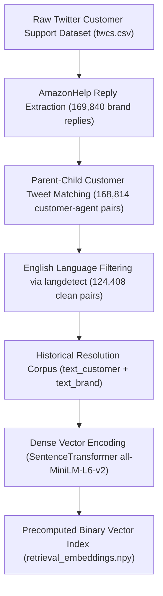
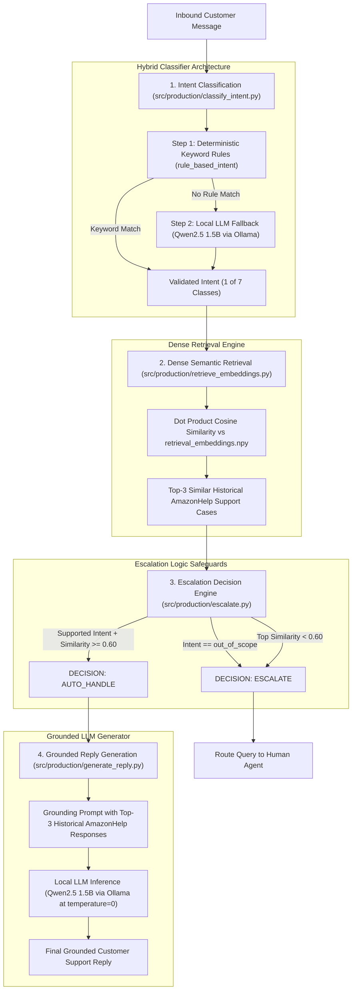

# Customer Support AI Agent (AmazonHelp)

An end-to-end e-commerce customer support AI agent built on Twitter Customer Support (TWCS) dataset for the **AmazonHelp** brand. The agent classifies inbound customer messages into specific support intents, retrieves relevant historical brand resolutions using semantic embeddings, determines whether to auto-handle or escalate the query using a confidence threshold, and generates grounded customer support replies using a local LLM.

---

## 1. Project Overview

The objective of this project is to build an automated support pipeline for AmazonHelp queries that handles routine customer requests while safely escalating ambiguous, low-confidence, or out-of-scope messages to human agents.

The core pipeline processes a customer message through four sequential stages:
1. **Intent Classification**: Predicts message intent using hybrid keyword rules + local LLM fallback.
2. **Semantic Retrieval**: Retrieves top-3 historical AmazonHelp responses using Sentence Transformer embeddings.
3. **Escalation Decision**: Evaluates rules (intent scope, similarity threshold) to decide `auto_handle` vs `escalate`.
4. **Reply Generation**: Generates a customer-facing support reply grounded on historical brand resolutions if `auto_handle` is selected.

---

## 2. System Architecture

### 2.1 Offline Data Preparation & Embedding Indexing



### 2.2 Online Customer Message Inference & Routing Pipeline



The offline data preparation pipeline extracts `@AmazonHelp` customer-agent pairs from the raw Twitter Customer Support (TWCS) dataset, cleans non-English text, and precomputes dense vector representations for 124,408 support pairs using `all-MiniLM-L6-v2`. During online inference, an incoming customer message is classified across 7 supported intents using deterministic keyword rules backed by `Qwen2.5 1.5B` via Ollama. Dense retrieval fetches the top-3 similar historical cases; if the query is out of scope or top retrieval similarity is below the 0.60 threshold, the system escalates to a human agent, otherwise `Qwen2.5 1.5B` generates a grounded support reply.

---

## 3. Problem Statement

Customer support teams receive high volumes of social media queries ranging from simple order status inquiries to complex complaints. Fully automated response systems risk hallucinating policies, links, or actions. Conversely, manual handling of every message causes long resolution delays. This project implements a grounded retrieval-augmented support agent coupled with deterministic escalation safeguards to ensure high relevance and safety.

---

## 4. Selected Brand

* **Brand**: `AmazonHelp`
* **Data Source**: Twitter Customer Support (TWCS) dataset (`data/raw/twcs.csv`).

---

## 5. Supported Scope & Intent Labels

The agent supports **7 intent classes**:

1. `delivery_status`: Inquiries about current package location, tracking status, or delivery progress.
2. `delivery_delay_or_missing`: Reports of overdue, late, or missing deliveries.
3. `return_request`: Requests or questions regarding how to return an item.
4. `refund_pending`: Questions or complaints about pending/unreceived refunds.
5. `wrong_or_damaged_item`: Issues involving damaged, defective, broken, or incorrect items.
6. `order_change_or_cancellation`: Explicit requests to modify or cancel an existing order.
7. `out_of_scope`: Any query falling outside the 6 supported e-commerce support intents.

---

## 6. Out-of-Scope Categories

Queries classified as `out_of_scope` include:
* Amazon Prime membership or trial issues
* Amazon devices & digital services (Alexa, Echo, Kindle, Fire TV, Amazon Music, Amazon Pay)
* Seller accounts and merchant issues
* General complaints, opinions, praise, thank-you notes, or status updates without an explicit support action request

---

## 7. Dataset & Preprocessing

* **Raw Data**: `data/raw/twcs.csv` (Twitter Customer Support dataset).
* **Brand Extraction & Pairing (`src/production/filter_brand.py`)**:
  * Extracted 169,840 `AmazonHelp` brand replies (`author_id == "AmazonHelp"`).
  * Matched parent customer tweets via `in_response_to_tweet_id` to form 168,814 customer → AmazonHelp pairs (`amazonhelp_pairs.csv`).
* **English Filtering (`src/production/filter_english.py`)**:
  * Applied `langdetect` (seed 42) with a minimum customer text length of 5 characters.
  * Yielded 124,408 clean English customer-agent pairs (`amazonhelp_english_pairs.csv`).

---

## 8. Golden Evaluation Set

* **Dataset (`src/evaluation/check_golden_data.py`)**: Sampled 200 unique customer tweets (`eval/golden_set.csv`) for manual intent labeling.
* **Reference / Test Split (`src/evaluation/split_golden_set.py`)**:
  * Fixed split using `random_state=42`.
  * **Reference Set**: 150 cases (`eval/golden_reference.csv`), used for few-shot prompt examples and TF-IDF baseline reference data.
  * **Held-out Test Set**: 50 cases (`eval/golden_test.csv`), reserved strictly for evaluation.

---

## 9. Intent Classification

* **Implementation (`src/production/classify_intent.py`)**: Hybrid system:
  1. **Deterministic Rules**: Heuristic keyword/phrase matching for out-of-scope terms (e.g., "alexa", "prime"), returns ("return"), refunds ("refund"), wrong/damaged items ("damaged product"), and cancellations ("cancel my order").
  2. **LLM Fallback**: If no rule matches, calls local Ollama LLM (`qwen2.5:1.5b`, `temperature=0`) with intent definitions and 150 reference examples (`eval/intent_reference_examples.csv`).
* **Evaluation Results**:
  * **Held-out Test Accuracy**: **50.00%** (25/50 correct).
  * **Majority-Class Baseline**: **52.00%** (26/50 correct, predicting `out_of_scope`).
  * *Note*: The intent classifier does not beat the majority baseline on the test split due to subtle intent boundary overlaps (e.g., distinguishing `delivery_status` vs `delivery_delay_or_missing`).

---

## 10. Semantic Retrieval

* **Baseline**: TF-IDF vectorizer + cosine similarity (`src/production/retrieve.py` / `src/evaluation/classify_tfidf.py`). Simple keyword matching failed on semantic variations without exact token overlaps.
* **Final Technique (`src/production/retrieve_embeddings.py`)**: Dense vector retrieval using `SentenceTransformer("all-MiniLM-L6-v2")`.
  * Precomputed 384-dimensional normalized embeddings for 124,408 English customer-agent pairs stored on disk (`data/processed/amazonhelp_embeddings.npy` or `retrieval_embeddings.npy`).
  * Performs in-memory dot product search (`CASE_EMBEDDINGS @ query_embedding`) to retrieve the top `k=3` most similar historical support cases.

---

## 11. Reply Generation

* **Implementation (`src/production/generate_reply.py`)**: Local LLM generation via Ollama (`qwen2.5:1.5b`, `temperature=0`).
* **Grounding Context**: Prompt embeds top-3 historical AmazonHelp responses as evidence.
* **Privacy & Safety Constraints**: Historical customer messages are explicitly excluded from the prompt to avoid leaking third-party handles, names, or order numbers. Prompt enforces strict rules against inventing tracking numbers, URLs, policies, or claiming unperformed actions.

---

## 12. Escalation Safeguards

* **Implementation (`src/production/escalate.py`)**: Deterministic 4-step decision tree (`decide_escalation`):
  1. If `intent == "out_of_scope"` → `escalate` (Reason: Request outside supported intents).
  2. If `not retrieved_cases` → `escalate` (Reason: No historical cases retrieved).
  3. If `top_similarity < 0.60` → `escalate` (Reason: Retrieved cases not sufficiently similar).
  4. Otherwise → `auto_handle`.

---

## 13. Evaluation & Results

### Valid Metrics Summary

| Metric | Score / Value | Description |
| :--- | :--- | :--- |
| **Intent Accuracy** | **50.00%** (25/50) | Automated evaluation on 50 held-out test cases (`eval/golden_test.csv`) |
| **Majority Baseline** | **52.00%** (26/50) | Baseline accuracy predicting majority class (`out_of_scope`) |
| **Human Relevance** | **100.00%** (10/10) | Positive rate on 10 human-reviewed test cases (`eval/human_agreement.csv`) |
| **Human Helpfulness** | **70.00%** (7/10) | Positive rate on 10 human-reviewed test cases (`eval/human_agreement.csv`) |
| **Human Grounding** | **30.00%** (3/10) | Positive rate on 10 human-reviewed test cases (`eval/human_agreement.csv`) |

*Note on Human Review*: Human evaluation was conducted on a subset of 10 non-out-of-scope test cases (`n=10`). The percentages reflect positive indicator rates scored by one human rater, **NOT inter-rater agreement**.

### Experimental / Unreliable Evaluations
* **LLM Reply Judge (`src/evaluation/evaluate_replies.py`)**: Attempted using `qwen2.5:1.5b` to rate replies 1–5. Produced flat output scores of 1 across all metrics due to prompt/parsing limitations.
* **LLM Evidence Judge (`src/evaluation/evaluate_evidence.py`)**: Attempted using `qwen2.5:1.5b` to extract and label claims. Falsely labeled hallucinatory claims as "supported" (producing an invalid 100% rate). Treated as an abandoned/unreliable experiment and excluded from valid metrics.

---

## 14. Known Limitations

1. **Intent Classifier Performance**: The hybrid classifier achieved 50% accuracy on held-out test data, failing to beat the 52% majority baseline due to boundary confusion between closely related intents.
2. **Reply Grounding & Hallucinations**: Human review showed only a 30% grounding rate. The small 1.5B model frequently fabricates generic Twitter short links (e.g. `https://t.co/...`) or policy details despite system prompt constraints.
3. **Evaluation Script Limitations**: LLM-as-judge experiments proved unreliable with the 1.5B local model.
4. **Test Set Size & Class Imbalance**: The held-out test set contains 50 cases and has zero representations of `order_change_or_cancellation`.
5. **System Architecture**: Embeddings are queried via in-memory NumPy matrix multiplication rather than a production vector database. The system is an experimental prototype and is **not production-ready**.

---

## 15. How to Run the Project

### Prerequisites
* **Python**: 3.10 or higher
* **Ollama**: Installed and running locally (`http://localhost:11434`)
* **Local Model**: Pull the Qwen2.5 1.5B model:
  ```bash
  ollama pull qwen2.5:1.5b
  ```

### Installation
1. Clone or navigate to the repository directory:
   ```bash
   cd E:\customer-support-ai-agent
   ```
2. Install Python dependencies:
   ```bash
   pip install -r requirements.txt
   ```

### Execution

* **Run Full Pipeline Tests**:
  ```bash
  python src/tests/smoke_test.py
  python src/tests/test_pipeline.py
  ```

* **Run Intent & Baseline Evaluation**:
  ```bash
  python src/evaluation/evaluate_baselines.py
  python src/evaluation/evaluate_intent.py
  ```

* **Run Human Agreement Calculation**:
  ```bash
  python src/evaluation/calculate_human_agreement.py
  ```

* **Programmatic Usage**:
  ```python
  from src.production.pipeline import process_customer_message

  result = process_customer_message("Where is my refund? I still haven't received it.")
  print("Intent:", result["intent"])
  print("Decision:", result["decision"])
  print("Reason:", result["reason"])
  print("Reply:", result["reply"])
  ```
